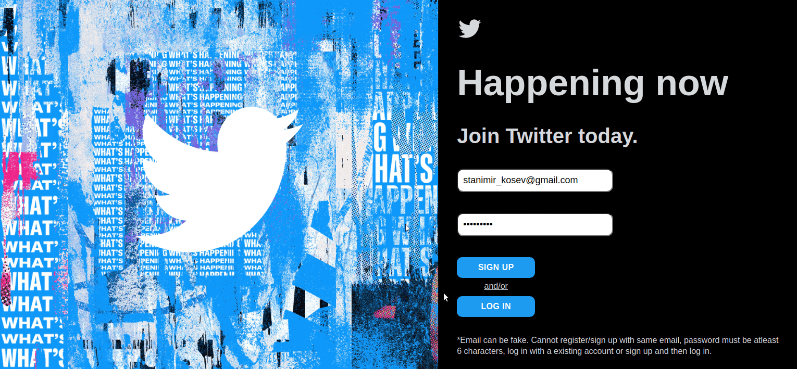

# odin-twitter-clone (javascript final project)

[Demo Link](https://stanimirkosev.github.io/odin-twitter-clone/)

The Odin Project Curriculum - Full Stack JavaScript Path - JavaScript Section - Project Nº19

Goal: Replicate your favorite website.

## Features:

- A user can create a account with email and password.
- A user can have an customizable name and profile picture.
- A user can tweet. The tweet contains a message and a picture.

## Tools:

- React
- Firebase - Cloud Firestore , Authentication , Cloud Storage
- Material UI
- React Flip Move
- React Twitter Embed
- React Router Dom

## Demo Gif:

